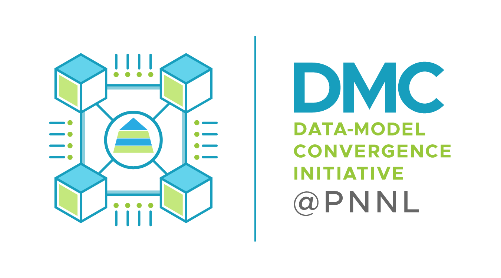

Welcome to COMET's documentation!
===================================

The **COMET** (*COMpiler for Extreme Targets*) compiler consists of a *Domain Specific Language* (DSL)
for sparse and dense tensor algebra computations
and, a progressive lowering process to map high-level operations to low-level architectural resources.
During the lowering process, a series of optimizations are performed,
and various intermediate representation (IR) dialects are used to represent key concepts, operations, 
and types at each level of the multi-level IR. 

COMET is built using `Multi-Level IR (MLIR) <https://mlir.llvm.org/>`_ Compiler Framework. 
Drawing motivation from MLIR, the COMET compiler performs different optimizations
and code transformations at each level of the IR stack.
Domain-specific, hardware-agnostic optimizations that rely on high-level semantic information are applied at high-level IRs.
These include reformulation of high-level operations in a form that is amenable for execution on heterogeneous devices 
(e.g., rewriting Tensor contraction operations as Transpose-Transpose-GEMM-Transpose) 
and automatic parallelization of high-level primitives (e.g., tiling for thread- and task-level parallelism).
Hardware-specific transformations are applied at low-level IRs, either within COMET/MLIR or through vendor backends. 
At this time, COMET supports execution on CPUs, GPUs, and FPGAs. 

Check out the rest of the documentation for further information. 
The :doc:`overview` section provides an introduction to COMET compiler
and also provides an overview of supported front-ends and backend architectures. 
For a quick usage reference, please have a look at
the :doc:`started` section for how to build, install and test COMET.

Get Started Now
---------------
`See our project on GitHub <https://github.com/pnnl/COMET>`_

License
-------
This project is licensed under the Simplified BSD License. 
See the `LICENSE file <https://github.com/pnnl/COMET/blob/master/LICENSE>`_ 
and the `DISCLAIMER file <https://github.com/pnnl/COMET/blob/master/DISCLAIMER.txt>`_ for more details.

Reporting Issues
----------------
Issues with COMET can be reported through `GitHub <https://github.com/pnnl/COMET/issues>`__.
We will try our best to timely address issues reported by users.
The community is also welcome to discuss any remedies or experience that may help to resolve issues.

Contributions
-------------
Contributions to COMET are welcome.
The community can get involved by contributing some new feature, reporting bugs, and/or improving documentation.
Please feel free to create a pull-request on `GitHub <https://github.com/pnnl/COMET/pulls>`__ for code contributions.
We will try our best to timely incorporate user requests.

Contact Us
----------
We encourage you to use GitHub's tracking system to report any issues or for code contributions as mentioned above. 
For any other queries, please feel free to contact us via email:

* **Gokcen Kestor** (email: *first-name <dot> last-name <at> pnnl <dot> gov*), `Pacific Northwest National Laboratory (PNNL), United States <https://www.pnnl.gov/>`_. 
* **Rizwan Ashraf** (email: *first-name <dot> last-name <at> pnnl <dot> gov*), `Pacific Northwest National Laboratory, United States <https://www.pnnl.gov/>`_.
* **Ryan Friese** (email: *first-name <dot> last-name <at> pnnl <dot> gov*), `Pacific Northwest National Laboratory, United States <https://www.pnnl.gov/>`_.
* **Polykarpos Thomadakis** (email: *first-name <dot> last-name <at> pnnl <dot> gov*), `Pacific Northwest National Laboratory, United States <https://www.pnnl.gov/>`_.
* **Zhen Peng** (email: *first-name <dot> last-name <at> pnnl <dot> gov*), `Pacific Northwest National Laboratory, United States <https://www.pnnl.gov/>`_.

Cite Our Project
----------------
If you use COMET in your research or work, please *cite* any of the following relevant papers:

* Erdal Mutlu, Ruiqin Tian, Bin Ren, Sriram Krishnamoorthy, Roberto Gioiosa, Jacques Pienaar & Gokcen Kestor, *COMET: A Domain-Specific Compilation of High-Performance Computational Chemistry,* In: Chapman, B., Moreira, J. (eds) Languages and Compilers for Parallel Computing, LCPC 2020, Lecture Notes in Computer Science, vol 13149, Springer, Cham. `DOI <https://doi.org/10.1007/978-3-030-95953-1_7>`_ and `BIB <https://citation-needed.springer.com/v2/references/10.1007/978-3-030-95953-1_7?format=bibtex&flavour=citation>`__.

::

   @InProceedings{COMET:LCPC-20,
      author={Mutlu, Erdal and Tian, Ruiqin and Ren, Bin and Krishnamoorthy, Sriram and Gioiosa, Roberto and Pienaar, Jacques and Kestor, Gokcen",
      editor={Chapman, Barbara and Moreira, Jos{\'e}},
      title={COMET: A Domain-Specific Compilation of High-Performance Computational Chemistry},
      booktitle={Languages and Compilers for Parallel Computing},
      year={2022},
      publisher={Springer International Publishing},
      address={Cham},
      pages={87--103}
    }

* Ruiqin Tian, Luanzheng Guo, Jiajia Li, Bin Ren, & Gokcen Kestor, *A High Performance Sparse Tensor Algebra Compiler in MLIR,* In: IEEE/ACM 7th Workshop on the LLVM Compiler Infrastructure in HPC, LLVM-HPC 2021, November 14, 2021, St. Louis, MO, United States. `DOI <https://doi.org/10.1109/LLVMHPC54804.2021.00009>`__ 

::

   @InProceedings{COMET:LLVM-HPC-2021,
      author={Tian, Ruiqin and Guo, Luanzheng and Li, Jiajia and Ren, Bin and Kestor, Gokcen},
      booktitle={2021 IEEE/ACM 7th Workshop on the LLVM Compiler Infrastructure in HPC (LLVM-HPC)}, 
      title={A High Performance Sparse Tensor Algebra Compiler in MLIR}, 
      year={2021},
      pages={27-38},
      doi={10.1109/LLVMHPC54804.2021.00009}
   }

Support
-------
The COMET compiler is supported in part by the `Data-Model Convergence (DMC) <https://www.pnnl.gov/projects/dmc>`_ 
initiative at the `Pacific Northwest National Laboratory <https://www.pnnl.gov/>`_.

This work is also supported in part by the `High Performance Data Analytics (HPDA) <https://www.pnnl.gov/computing/HPDA/>`_ program
at the `Pacific Northwest National Laboratory <https://www.pnnl.gov/>`_.
 
This work is also supported in part by the U.S. Department of Energy’s (DOE) `Office of Advanced Scientific Computing Research (ASCR) <https://www.energy.gov/science/ascr/advanced-scientific-computing-research>`_
as part of the `Center for Artificial Intelligence-focused Architectures and Algorithms (ARIAA) <https://www.pnnl.gov/projects/co-design-center-artificial-intelligence-focused-architectures-and-algorithms>`_.
 

.. note::

   This project is under active development and this documentation may be updated with future releases.

Contents
--------

.. toctree::
   :maxdepth: 2

   overview
   started
   frontends
   operations
   optimizations
   passes
   refs
