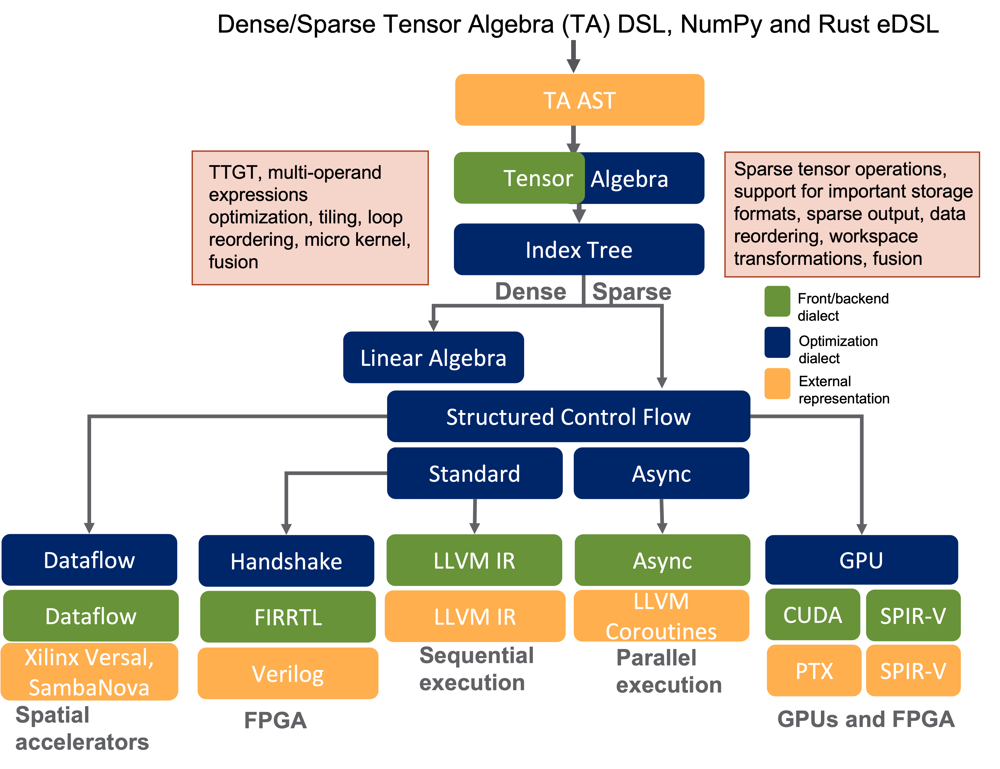

Introduction
============

COMET is a domain-specific programming language and compiler infrastructure targeting heterogeneous accelerators.
COMET's primary objective it to ease accelerating high-performance computing (HPC) and graph analytics applications on target heterogeneous computing devices. COMET abstracts the low-level architectural details of heterogeneous devices so that scientists can focus on their algorithms and applications.
The support for some COMET optimizations, such as those for tensor contractions, is inspired by the computational chemistry domain,
whereas graph primitives, such as the semiring, is inspired by the graph analytics domain.
We expect broad usage of the COMET compiler and the addition of more operations and optimizations as the user base grows and requirements evolve.
The COMET compiler is designed to increase the productivity of scientists while providing performance portability across multiple architectures. 
This objective is achieved by pursuing a domain-specific compiler approach, where the architecture details are decoupled from users through an easy-to-use domain-specific language (DSL).

COMET is based on the Multi-Level Intermediate Representation (`MLIR <https://mlir.llvm.org/>`_)
introduced by Google to simplify writing new compiler infrastructures. 
In the COMET multi-level IR, domain-specific, application-dependent optimizations are performed at higher levels of the
IR stack where operations resemble programming languages’ abstractions and can be optimized based on the operations semantics.
Generic, architecture-specific optimizations are, instead, performed at lower-levels, where simpler operations are mapped to
the memory hierarchy and to processor’s registers.
A distinct advantage of a compiler-based approach compared to library-based
solutions (e.g., `Intel MKL <https://www.intel.com/content/www/us/en/develop/documentation/oneapi-programming-guide/top/api-based-programming/intel-oneapi-math-kernel-library-onemkl.html>`_, `TBLIS <https://github.com/devinamatthews/tblis/wiki>`_, `HPTT <https://github.com/springer13/hptt>`_) is that COMET can handle arbitrary multi-operand tensor expressions and perform state-of-the-art algorithmic and code optimizations.

Users of COMET are expected to express their tensor algebra programs in a language that logically maps to their domains. 
Besides the native COMET DSL, at this time, COMET supports the Python NumPy and Rust programming front-ends.
During the compilation process, language operators, types, and structures are mapped to an abstract syntax tree (AST).
The AST is then converted to the tensor algebra (TA) *dialect*,
the first dialect in the COMET IR stack.
The TA dialect contains domain-specific concepts, such as multi-dimensional
tensors, contractions, and tensor expressions.
Here, several domain-specific optimizations are performed, such as reformulating tensor
contractions using the TTGT (transpose-transpose-GEMM-transpose) method.

Next, COMET lowers the TA dialect representation of the computation to index tree (IT) dialect.
The index tree dialect is part of the COMET compiler and is used for optimization of sparse computations.
For example, workspace transformations are applied at the index tree representation of the program.
The index tree representation makes it easy to transition to loop computations.
The IT dialect is then converted to the `Structured Control Flow (SCF) dialect <https://mlir.llvm.org/docs/Dialects/SCFDialect/>`_.
SCF dialect is part of the MLIR framework. 
At this stage, there is a departure from domain-specific concepts but the operations are still architecture-independent.
The next step consists of further lowering where COMET performs architecture-specific optimizations and requires information for the specific target.

If one wants to execute a program on a CPU, COMET lowers code to the MLIR's standard or async dialects. 
For instance, for serial execution, the standard dialect is converted to LLVM IR, that is further lowered using the existing LLVM backend.
Similarly, the GPU dialect available in MLIR is used for optimizations to perform on kernels. 
The GPU dialect is then lowered to lower level languages based on the GPU vendor (e.g., PTX or SPIR-V). 
Converting code to `SPIR-V <https://www.khronos.org/registry/SPIR-V/>`_ representation provides a path to synthesize a circuit that executes on FPGA-based accelerators.
In this case, the SPIR-V code generated needs to be properly post-processed to meet the requirements of the FPGA vendor's toolchain, such as Xilinx Vitis. 
Finally, COMET can lower code to vendor-specific dialacts (which may or may not be publicly available) to generate code for emerging architectures, such as Xilinx Versal AI engines or SambaNova SN10. 
For a summary of the COMET compliation flow, please see the figure below.

   COMET compilation flow.

.. autosummary::
   :toctree: generated

